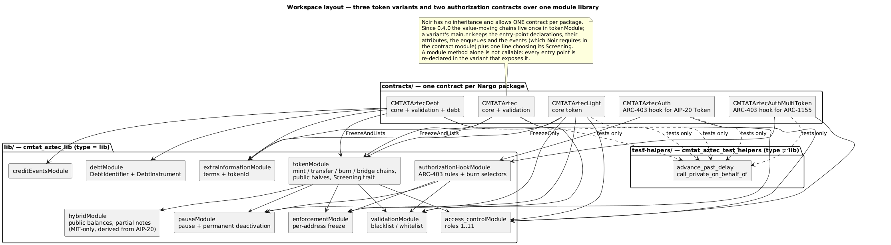
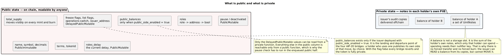
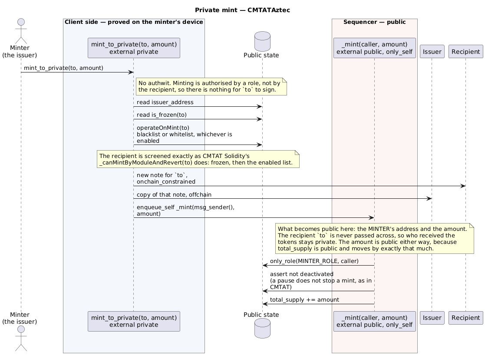
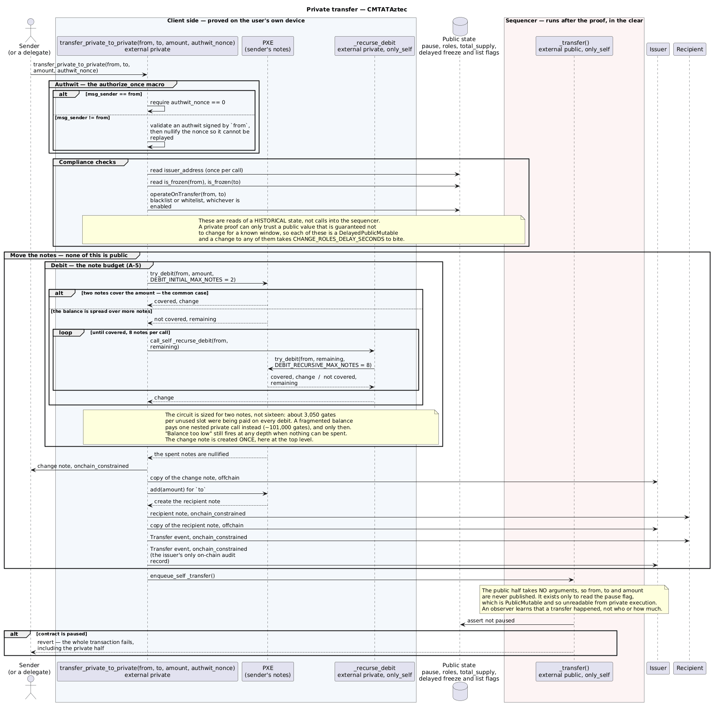
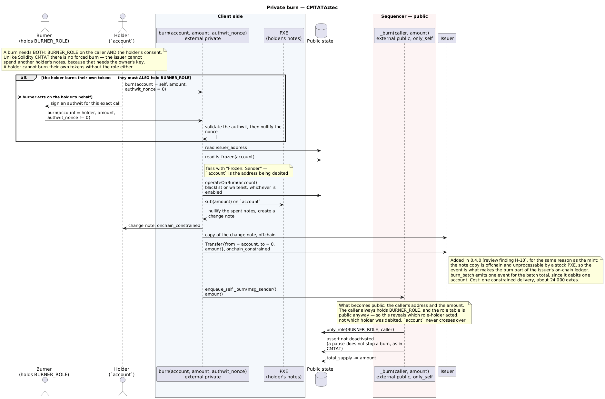
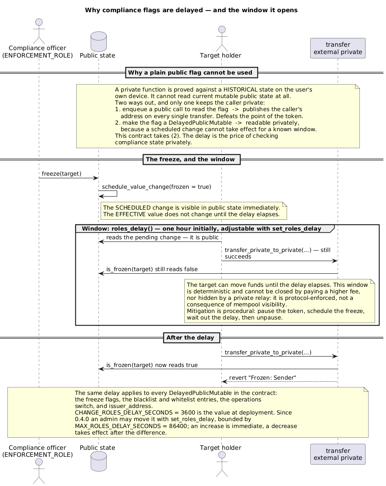

# Private CMTAT security token

This project implements a private version of the CMTAT security token,
using [Aztec](https://aztec.network/).
This allows banks and financial institutions to benefits from
tokenization while maintaining privacy and compliance.

[Aztec](https://aztec.network/) is a privacy-focused Layer 2 solution on
Ethereum that enables confidential transactions using zero-knowledge
proofs (ZKPs). 

[CMTAT](https://github.com/CMTA/CMTAT?tab=readme-ov-file) is a framework
for the tokenization of securities in compliance with local regulations.
This project integrates Aztec with CMTAT, allowing financial
institutions to adopt the standard while preserving transaction
confidentiality.

This repository contains a functional private CMTAT prototype, where
transactions remain private for users, while issuers retain the ability
to audit and monitor activity to ensure compliance. This marks a
significant step forward, enabling institutions to participate in
tokenized markets without exposing confidential data—overcoming one of
the key limitations of public blockchains.

**Disclaimer:** Aztec is under heavy developpment, and this repository
may be subject to rapid changes. Significant updates will needed once
Aztec reaches mainnet. Additionally, unlike CMTAT, this code has not
been audited and may not be fully compliant with the Swiss law. 


## Table of contents

- [Key terms](#key-terms)
- [Deployment variants](#deployment-variants)
- [Functionalities overview](#functionalities-overview)
- [Private token implementation](#private-token-implementation)
  - [Assumptions and requirements](#assumptions-and-requirements)
  - [Storage](#storage)
  - [Overview](#overview)
  - [Mint private specifications](#mint-private-specifications)
  - [Transfer private specifications](#transfer-private-specifications)
  - [Burn private specifications](#burn-private-specifications)
  - [Batching limits](#batching-limits)
  - [Security and confidentiality properties](#security-and-confidentiality-properties)
  - [Modules](#modules)
  - [Issuer's view of transactions and notes](#issuers-view-of-transactions-and-notes)
- [Deployment](#deployment)
- [Comparison with Solidity CMTAT](#comparison-with-solidity-cmtat)
- [Comparison with CMTAT-Confidential (Zama FHE)](#comparison-with-cmtat-confidential-zama-fhe)
- [Limitations](#limitations)
- [Miscellaneous](#miscellaneous)
- [Glossary](#glossary)
  - [Aztec protocol](#aztec-protocol)
  - [Aztec.nr and the code in this repository](#aztecnr-and-the-code-in-this-repository)
  - [CMTAT and this project](#cmtat-and-this-project)
- [Intellectual property](#intellectual-property)
- [Security policy](#security-policy)


## Key terms

Enough to read the rest of this document. The full [Glossary](#glossary) at the end defines every term used in the specification and the code.

| Term | Definition |
|---|---|
| **Private state** | Contract state held as encrypted **notes** in each holder's own client, not in public storage. A balance is the sum of a holder's notes; only they can spend them. |
| **Public state** | Ordinary onchain state, readable by anyone. Here it carries the total supply, the pause and freeze flags, the transfer-restriction lists and the role table. |
| **Note** | The unit of private state — a small record holding an amount. Its *hash* is published onchain; its content is not. |
| **Nullifier** | The value published when a note is spent, derived from the note and its owner's key. Duplicates are rejected, which is what prevents double-spending — and why nobody but the owner can spend a note. |
| **PXE** | *Private eXecution Environment* — the client-side component holding a user's keys and notes, and running private functions. One PXE cannot read another's notes. |
| **Issuer audit copy** | Every note created is delivered twice: to its owner, and to the issuer. That second copy is what lets the issuer reconstruct balances for compliance. |
| **Authwit** | *Authentication witness* — a one-shot authorisation letting a third party perform one exact call on your behalf. The Aztec counterpart of an ERC-20 `approve` + `transferFrom`. |
| **Delay on compliance flags** | Freezing an address, changing a list entry or changing the issuer takes effect only after a delay, because private functions can only read public state that is guaranteed stable. See [Limitations](#limitations). |

## Deployment variants

Noir has no inheritance and allows one contract per package, so the variants are separate contract packages over a shared module library (`lib/`), built together as a Nargo workspace.

| Variant | Contents |
|---|---|
| `CMTATAztecLight` | Private token, pause, deactivation, freeze, access control, terms, version — no transfer restriction lists |
| `CMTATAztec` | The above plus the validation module (blacklist / whitelist) |
| `CMTATAztecDebt` | The above plus credit events and debt, for bond-like instruments |

Because there is no inheritance, an entry point added to a shared module has to be declared in each variant's `main.nr` that should expose it.

## Functionalities overview

The private CMTAT supports the following core features:

 - **Private** mint, burn, and transfer operations
 - **Public** pause of the contract, permanent deactivation, and public freeze of specific accounts
 - **Auditability** of users private transactions by a central issuer
 - **Transfer restriction** via address blacklisting/whitelisting

Unlike the reference [Solidity CMTAT](https://github.com/CMTA/CMTAT), it
does not support:
 - Upgradeability
 - Gasless transactions

This reference implementation aims to fulfill the criteria required to
tokenize financial instruments such as bonds, equity shares, and private
credit notes.

You may modify the token code by adding, removing, or modifying
features, at your own risk.


## Private token implementation

### Assumptions and requirements

- **Assumptions**:
  - **Total supply visibility**: The `totalSupply` should remain public and be updated according to mint and burn operations.
  - **Issuer and admin addresses**: The addresses of the issuer and admin can be publicly known.
  - **Third-party transactions**: We want to allow third parties to execute transactions on behalf of our users, so we use **authentication witnesses** when transferring. (same functionality as `transferFrom` on EVM)
  - **Mint and burn restrictions**: There is no authentication witness in the `mint` and `burn` functions, as a third party is not allowed to mint or burn; only the issuer can perform these actions.
  - **Admin role**: The admin cannot be changed. Issuers can be added or removed by the admin.

- **Functionalities**:
  - **Totalsupply - Public Context**: For a particular CMTAT token, anyone may know the total number of tokens in circulation at any point in time.

  - **BalanceOf - Private Context**: For a particular CMTAT token and a particular user, no one apart from the issuer should know the number of tokens currently recorded on the user's ledger address.

  - **Transfer - Private Context**: Users may transfer some or all of their tokens to another ledger address (which the transferor does not necessarily control). Each transfer must remain private: only the transacting parties and the issuer may know that the transfer occurred, who the participants are, and how much was transferred.

    > **Note**: The issuer cannot do a force transfer on behalf of the user, as he would do in the Solidity version of CMTAT. The solution is that in the case where we want to have the same behaviour as a force transfer, we freeze the account.

  - **Mint - Private Context** Issue a given number of tokens to a given ledger address. The issuer and the recipient should be the only ones who know that a transaction is happening. Only the issuer and the receiving address should know the amount minted.

    > **Note**: According to the assumption, the total supply will increase accordingly in a public function, and thus the new total supply will be visible to everyone. The supply change amount will be traceable to that particular private proof.

  - **Burn - Private Context** The issuer burns (destroys) a given number of tokens from a given ledger address. The issuer and the given address should be the only ones who know that a transaction is happening.

    > **Note**: Under the above assumptions, a public function will reduce the total supply when a burn happens. Therefore, the updated total supply will be visible to everyone, and the amount of the change can be traced back to a specific private proof.

### Overview

Three deployment variants compose modules from one shared library. Noir has no inheritance and allows one contract per package, so a variant is a different *composition*, not a subclass.



_Diagram source: `doc/img/architecture.puml`._

What the token keeps private is the holder balances and the transfers between them. Everything an issuer needs to administer publicly — supply, roles, pause state, the compliance flags — stays public by design.



_Diagram source: `doc/img/state-split.puml`._

### Storage

- **Issuer_address**: `DelayedPublicMutable<AztecAddress, CHANGE_ROLES_DELAY_SECONDS>` - The address of the issuer, which receives a copy of every note and so can audit holder balances. It is a `DelayedPublicMutable` for two reasons: so that a *private* function can read it without a public call that would leak the caller, and so that it can be changed.
  - **It can be rotated by the admin**, with `set_issuer(new_issuer)` under `DEFAULT_ADMIN_ROLE`. The change is scheduled and becomes current after `CHANGE_ROLES_DELAY_SECONDS`; until then every mint, transfer and burn still addresses the previous issuer. The `IssuerChanged` event carries `effective_at`.
  - **Rotation transfers future visibility only.** Copies already delivered to the previous issuer cannot be recalled — a delivered note is delivered — so the previous issuer keeps what it has. The new issuer needs a PXE able to decrypt and store copies from the moment the change takes effect, or the audit trail has a hole for that period.
- **Balances**: `Owned<BalanceSet>` - Token balance of every user inside their PXE, accessed as `private_balances.at(address)`. The balance of a user is the sum of the amounts of all their private `UintNote`. `BalanceSet` now comes from the `balance_set` aztec-nr library rather than being defined in this repository.

### Mint private specifications



_Diagram source: `doc/img/mint-flow.puml`._

**Issuer**:

- The new notes of the recipient are broadcasted to the issuer.

**Failure cases**:

- **Enforcement module**: If the `recipient` address is frozen, the mint will fail.
- **Validation module**: If a list mode is enabled, the `recipient` is screened against it — a blacklisted recipient, or one missing from the whitelist, fails the mint. Same as CMTAT Solidity's `_canMintByModuleAndRevert(to)`.
- **Authorisation module**: If the caller doesn’t have the minter role, the mint will fail.
- **Pause module**: A pause does **not** stop a mint, as in CMTAT Solidity; deactivation does.

**Limitations**:

- `mint_batch` is capped at `MAX_ADDR_PER_CALL` recipients. See [Batching limits](#batching-limits) for how that number was arrived at.

### Transfer private specifications

The transfer is the flow worth reading closely: it shows the private half doing all the work on the user's own device, and the enqueued public half deliberately taking no arguments at all.



_Diagram source: `doc/img/transfer-flow.puml`._

**Issuer**:

- The added notes from sender and recipient are broadcasted to the issuer.

**Failure cases**:

- **Enforcement module**: If `from` or `to` addresses are frozen, the transfer will fail.
- **Validation module**: If operations are enabled, the module checks if `from` or `to` should be restricted.
- **Pause module**: If the contract is paused, the transfer will fail.

**Limitations**:

- `transfer_batch` is capped at `MAX_ADDR_PER_CALL` recipients, and transfer is the operation that sets that cap for all three. See [Batching limits](#batching-limits).

### Burn private specifications



_Diagram source: `doc/img/burn-flow.puml`._

**Issuer**:

- The new notes of the recipient (if any remaining) are broadcasted to the issuer.

**Failure cases**:

- **Enforcement module**: If the `account` being debited is frozen, the burn will fail.
- **Validation module**: If a list mode is enabled, the `account` is screened against it, as CMTAT Solidity's `_canBurnByModuleAndRevert(from)` does.
- **Authorisation module**: If the caller doesn’t have the burner role, the burn will fail.
- **Pause module**: A pause does **not** stop a burn, as in CMTAT Solidity; deactivation does.
- **Authwit**: If `from` doesn't issue an `AuthWit` the burn will fail

 > **Note**: The `AuthWit` issue is a key difference from Solidity smart contract logic, and users should be aware.  

**Limitations**:

- `burn_batch` is capped at `MAX_ADDR_PER_CALL` entries, all debited from the same account. See [Batching limits](#batching-limits).

### Batching limits

`mint_batch`, `transfer_batch` and `burn_batch` all act on at most `MAX_ADDR_PER_CALL` addresses, currently **4**.

That number is measured, not derived from the protocol constants. Every value was tried by setting the global, adjusting the tests and running the full Noir suite:

| `MAX_ADDR_PER_CALL` | `mint_batch` | `burn_batch` | `transfer_batch` | Result |
|---:|---:|---:|---:|---|
| 1 | 30,776 | 81,736 | 119,145 | all tests pass |
| 2 | 60,169 | 160,189 | 230,444 | all tests pass |
| **4** | **107,871** | **306,820** | **454,050** | **all tests pass** |
| 5 | — | — | — | transfer passes; batched mint and burn end with a wrong total supply |
| 6 | — | — | — | transfer aborts: `Assertion failed: push out of bounds` |
| 8 | — | — | — | transfer aborts: `Assertion failed: push out of bounds` |

Gate counts are from `aztec profile gates` on `CMTATAztec`, and the N=4 row is the current code: issuer read hoisted out of the loop, and one `Transfer` event per recipient.

Two caveats on that table.

- The 5, 6 and 8 rows were measured **before** `transfer_batch` emitted a `Transfer` event per recipient. Each event costs about 1,687 gates and one more private log, so it can only tighten the budget at those values, never loosen it. 4 has been re-verified with the event in place; the rows above 4 are therefore conservative rather than exact.
- The 5 row is an unexplained result, not a diagnosed one: transfer succeeds there but batched mint and burn finish with a wrong total supply and no protocol error. That is why the cap is 4 and not 5 — an unexplained failure is not a basis for a limit.

Three things are worth drawing out of that table.

- **Transfer sets the cap for all three.** It creates two notes and two constrained deliveries per recipient, where mint and burn create one, so it saturates the per-call note-hash and log budgets at roughly twice the rate. The cap is uniform because the three functions share one global.
- **The number of nested private calls is irrelevant.** The `_mint_internal` / `_transfer_internal` / `_burn_internal` helpers are `#[internal("private")]`, so the compiler inlines them: a batch makes no nested private calls at all, whatever the cap is. Earlier revisions of this document cited the 8-private-call limit as a constraint on batching; it never was one.
- **Batching moves work, it does not remove it.** A 4-recipient transfer is a 447,303-gate circuit against 119,145 for a single transfer — and that proof is produced on the *user's own device*. What batching saves is the fixed per-transaction protocol overhead, which four separate transfers would pay four times. Batch because you want one transaction, not because you want a cheaper circuit.

Raising the cap further means repeating the measurement, not re-reading the protocol constants. It is also an ABI change: the array lengths in `mint_batch`, `transfer_batch` and `burn_batch` are part of the generated interface.

### Security and confidentiality properties

#### What each operation publishes

Every private operation enqueues one public call, and **every argument of a public call is public**. What crosses that boundary is therefore the whole of what an outside observer learns; the three operations were designed so that as little as possible does:

| Operation | Public callee | Published in the clear | Kept private |
|---|---|---|---|
| `mint(to, amount)` | `_mint(caller, amount)` | the **minter's** address, the **amount** | the recipient `to` |
| `transfer(from, to, amount, …)` | `_transfer()` — **no arguments** | that a transfer of this token occurred | sender, recipient, amount |
| `burn(account, amount, …)` | `_burn(caller, amount)` | the **burner's** address, the **amount** | the debited `account` |

Three things follow, and they are worth stating precisely because the obvious reading of the table overstates the leak.

- **The amounts were public anyway.** `total_supply` is a `PublicMutable<u128>` that moves by exactly the minted or burned amount in the same transaction, so passing `amount` to the public half reveals nothing the supply change does not. This is a consequence of the design decision to keep the supply public, recorded under *Assumptions*.
- **The published address always holds a role.** `_mint` and `_burn` publish `msg_sender()` because they must check `MINTER_ROLE` / `BURNER_ROLE` on it, and the role table is public state anyone can enumerate. So the marginal disclosure is *which* role-holder acted and *when* — not a new identity. Where the issuer is the sole minter and burner, which is the expected deployment, this amounts to a public issuance-and-redemption ledger keyed to the issuer, which is arguably what a security token wants.
- **The holder is not published.** `to` in a mint and `account` in a burn stay in the private half. A burn executed by the issuer under a holder's authwit publishes the issuer, not the holder.

> **The caveat that matters: do not grant `BURNER_ROLE` to holders.** The privacy of a burn rests entirely on the burner and the holder being different parties. The moment a holder holds `BURNER_ROLE` and redeems its own tokens, the published burner *is* the holder, and that burn — address and amount — is fully public. The same applies to `MINTER_ROLE` and self-minting. These roles are issuer roles by design; delegating them to holders turns a private operation into a public one without any code changing.

The public callee's **selector** also distinguishes the three operations from each other — an observer can tell a mint from a burn from a transfer. For transfer that reveals only "a transfer happened"; for mint and burn it composes with the two rows above. There is no cheap fix: hiding the selector would mean one shared public function taking the operation kind as an argument, which publishes the same fact one level down, and would newly publish the caller on transfers.

- **Private mint call to public function**:
  - **Reveals minter address**: Since it is a parameter in the public function call. It is the issuer, whose address is already known, but still, private to public function calls pose a problem as they also reveal that the contract was called.
  - **Randomizing `msg.sender`**: An out-of-protocol option is to deploy a diversified account contract and route transactions through this contract. Application developers might also do something similar to randomize the `msg.sender` of their app contract's address.
  - **Leakage of minted amount**: The amount being minted is leaked as it is passed to the public function from the private one.
  > In the case of our token, when an issuer mints tokens, it is publicly known how much tokens he mints. This means that if the issuer mints “on-demand“ (every time a user wants to mint some tokens, the issuer mints) then there is a leak of information. This can be mitigated by the issuer minting a fixed amount of tokens at a certain point in time (= circulating supply), and then privately distributing to the users, thus revealing way less information. 
  - **Traceability**: The public transaction will be traceable back to the private proof.
  - **Disclosure of private function call**: It will leak that a private function (`private_mint`) has been called.
  - **Recipient address privacy**: It will **not** leak the address to which this amount is being sent.


- **Note encryption constraints**:
  - Note encryption should be **constrained**. We could make note encryption and tagging unconstrained, as this is allowed, but we don’t want to.
  - **Incentive alignment**: Unconstrained note encryption is done when the sender has an incentive to send correct information to the receiver, as no one proves and verifies it. However, in our case, the sender is in no way incentivized to do the right thing.
  - **Optimization**: For optimization purposes, unconstrained might be acceptable in some places.

### Modules

Aztec Noir uses Rust-like modularity, which means that there is no Solidity-like abstract contract and inheritance. Instead, we use separated modules in the form of interfaces and implementations. Every function that can or should be called by a user needs to be exposed in the main contract. Consequently, not everything can be displaced from the main contract (e.g., `mint`, `burn`, and `transfer` are all in the main contract), and most functions are exposed there.

#### Authorisation module (access control) - Public Context

- This module is used by other modules and by the `mint` and `burn` functions.
- Modules only need to call the `only_role` function, which publicly verifies if an address has sufficient roles for the action; otherwise, it reverts.
- The default role is the `DEFAULT_ADMIN_ROLE`, which can grant other roles.
- **Implementation note**: This module's implementation is quite cumbersome, as in the main contract, an instance of this module is passed to each function call. This is because the object is unique, and we cannot pass it as a context (at least until a working implementation is found).

#### Validation module - Shared Context

- This module is called only when performing transfers.
- The `operateOnTransfer` function, used in a private context, is called by the transfer function.
- Each user flag update will be delayed by `CHANGE_ROLES_DELAY_SECONDS`.
- If no operations are enabled, no checks are done, but the function is still called.
- Operations can be enabled or disabled, and there is also a delay.
- Currently, no operations can be added; there is only blacklist/whitelist.

**Delay issue**:

The diagram below is the whole argument in one picture: why the flags must be delayed, and what that delay costs.



_Diagram source: `doc/img/delayed-flag.puml`._

- The delay is caused by the fact that the roles are stored in a `DelayedPublicMutable` variable type.
- This is needed to preserve privacy when doing a private transfer between two users while maintaining the strict rule that no tokens should be transferred from/to a blacklisted address.
- **Problem**: A user who knows they are going to be blacklisted before the delay elapses might send their funds to an address that is not blacklisted. This problem has no solution for now.
- **Consideration**: We need to think about whether the shared state will be changed often. If not, then `DelayedPublicMutable` is an acceptable solution; otherwise, it might be problematic.

**Potential solutions**:

- **Theoretical solution 1**: Using a `DelayedPublicMutable` is essential because otherwise, you would use a `PublicMutable`, which means that the user calling the transfer function needs to call a public function to read the `PublicMutable` variable, leaking the sender’s address. One possible solution might be to hide the caller's address using [Diversified and Stealth Addresses](https://docs.aztec.network/protocol-specs/addresses-and-keys/diversified-and-stealth). If reading `PublicMutable` did not leak the user address, then `DelayedPublicMutable` would be unnecessary.
- **Theoretical solution 2**: Have a counter that is set when the `DelayedPublicMutable` is changed. For the `COUNTER` amount of time, the token contract is paused to prevent any blacklisted address from retrieving funds. This solution is poor in terms of user experience and developer experience, as the issuer needs to manually unpause the contract.
- **Practical solution 3**: If we whitelist instead of blacklist, a new whitelisted address will not be able to transfer funds directly, which is not a significant issue.

#### Pause module - Public Context

- The pause module is a `PublicMutable`.
- The functions to set and unset the pausable flag are protected under Access Control.
- The pause check is done in public state, in the enqueued half of `transfer`. As in CMTAT Solidity, `mint` and `burn` are not stopped by a pause; their enqueued halves check deactivation instead, so a deactivated token (which is paused forever) can do none of the three.

#### Enforcement module - Shared Context

- This module is called in `mint`, `transfer`, and `burn` to check if an address has been frozen.
- Unlike the validation module, this module is mandatory.
- Changing an address to frozen has a delay, as the value is a `DelayedPublicMutable`.

> **"Freeze Address" Note**: The enforcement has a delay, similar to the validation module. One approach is to pause the contract before freezing some accounts for the delay time, then unpause it. This requires manual pause/unpause.

### Issuer's view of transactions and notes

- **Objective**: Enable the issuer to see all transactions.
- **Current implementation**: Note emission is duplicated: one message for the owner of that note, and a second copy of the same message for the issuer (`deliver_to(issuer, ...)`).
- **Delivery mode of the issuer's copy**: the owner's copy is delivered onchain and constrained; the issuer's copy is delivered **offchain**. Aztec's own documentation presents an onchain constrained copy to an auditor as the supported pattern, but PXE cannot process an onchain note message addressed to someone who is not the note's owner: note discovery computes the note's nullifier, which needs the owner's nullifier key. Delivering the issuer's copy offchain sidesteps that, at the cost of the issuer's copy having no onchain data availability - the issuer must capture these messages as they are produced, and a sender who drops them is not detectable onchain.
- **Other potential implementations**:
  - **App-siloed key**: Use an app-siloed key that the issuer can use for decrypting any note in the note hash tree of this app.

## Deployment

### Sandbox

Use these deployment instructions for quick testing.

Get the **sandbox, aztec-cli, and other tooling** with this command:

```bash
bash -i <(curl -s https://install.aztec.network)
```

Install the correct version of the toolkit with:

```bash
aztec-up install 5.2.0
```
version should match [Nargo.toml](https://github.com/taurusgroup/private-tokens/blob/master/Nargo.toml) dependency versions. More instructions [here](https://docs.aztec.network/guides/getting_started)

Start the sandbox with:

```bash
aztec start --sandbox
```

Run:

```bash
yarn install
yarn compile
yarn codegen
yarn test
```

The contract is deployed on the sandbox, by the [setup function](https://github.com/taurushq-io/private-CMTAT-aztec/blob/master/src/test/utils.nr), and all the tests are run.

### Testnet

---

Use these deployment instructions for Testnet interactions.Testnet interactions are possible via scripts in the `./scrpits` folder. With the below commands, we run the `deploy_contract.ts` script. 

Run:

```bash
yarn compile
yarn codegen
yarn deploy
```

If you run into troubleshooting issues, consult the [Aztec starter repository](https://github.com/AztecProtocol/aztec-starter/tree/main) and try running it first.


## Comparison with solidity CMTAT

### What can we actually do with private CMTAT?

- **Mint/transfer**: Behave the same way as in CMTAT. 
- **Burn**: We can perform `burn_from` with allowance.
- **Validation module**: Whitelisting and blacklisting are enabled on demand. The rule engine has been merged into the validation module, providing one interface that manages both and is always deployed along the main contract. The functionalities are private; storage can be read in public.
- **Pause module**: Same functionalities as CMTAT. Pause is public and instantaneous. Deactivation follows the CMTAT Solidity model: `deactivate_contract` requires the admin role and an existing pause, and once set it blocks `unpause_contract` forever, so the token can never move again. `public_get_deactivated` reads the flag.
- **Enforcement module**: Freeze and unfreeze are supported. Functionalities are private; storage can be read in public. There is a delay.
- **Access control module**: Same functionalities as CMTAT. Admin has the default role, which can be used to grant roles to themselves or others.
- **Version**: `version()` returns the implementation version as a compile-time constant, as CMTAT Solidity's `VersionModule` does. Aztec's contract class ID identifies the deployed artifact, but being a hash it neither orders releases nor matches a release tag, so the two are complementary.
- **Extra information module**: `set_token_id` / `token_id` carry the CMTAT token identifier, and `set_terms` / `terms` carry the reference to the legally required documentation, using the CMTAT Solidity notation (`DocumentInfo` of name, URI and document hash, with `lastModified` stamped by the contract). Guarded by `EXTRA_INFORMATION_ROLE`.
- **Credit events and debt modules**: Same functionalities as CMTAT. The debt record mirrors the Solidity `ICMTATDebt` interface field for field: a `DebtIdentifier` (issuer name and description, guarantor, debtholder representative) followed by a `DebtInstrument` (rate, par value, minimum denomination, dates, conventions, payment currency).

### What will we be able to do in the future?

- **Larger batches**:
  - The cap is currently 4 addresses per call, set by the per-call note-hash and log budgets rather than by the private-call budget — see [Batching limits](#batching-limits).
  - As those budgets grow, the cap can be raised: the logic is already written for arbitrary batch sizes. Each raise needs re-measuring rather than re-reading the constants, and the per-recipient proving cost grows with it.

> These functions are not separated into their own “abstract contract” as it does not exist in Aztec. We could put them in a library but this would mean much more boilerplate code. Following Aztec improvements, we may improve composition/abstraction in the future. 

- **Validation module enhancements**:
  - The limitation regarding `DelayedPublicMutable` delay means changes to the whitelist/blacklist have a delay (minutes to hours) before reflecting on the blockchain.
  - A sanction-list mode is not provided, for lack of an on-chain list to check against — there is no Aztec equivalent of the Chainalysis oracle used on Ethereum.

- **Audit capabilities**:
  - Users may, in the future, be able to arbitrarly share to third-parties a shareable key for audit purposes.

- **Event management**:
  - Every state-changing entry point now emits a public event: `NewRole` / `RoleRevoked`, `Paused` / `Unpaused` / `Deactivated`, `AddressFrozen`, `AddressListed`, `OperationsSet`, `Terms`, `TokenId`, and the debt-variant `DebtLogEvent` / `DebtInstrumentLogEvent` / `CreditEventsLogEvent`. Events must be declared in the contract module rather than in the library, which is why each variant's `main.nr` re-declares them.
  - Events for delayed flags (`AddressFrozen`, `AddressListed`, `OperationsSet`) carry `effective_at`, the timestamp from which the scheduled value is current, so an indexer need not know the delay.
  - `Transfer` is delivered privately to the recipient; what remains open is its delivery mode and whether the issuer should receive it — see the analysis report, findings C-2 and H-4.

### What will we never be able to do by design?

- **Force burning without consent**:
  - We will never be able to burn someone else’s tokens without their approval.
  > This could be possible if the token is implemented at the account contract level, and the issuer has shared nullifiers with the user for that specific account that holds notes for this token.

- **Immediate shared state changes**:
  - We cannot have a shared state (public and private) that has no delay when changed, due to the protocol's construction.

## Comparison with CMTAT-Confidential (Zama FHE)

[CMTAT-Confidential](https://github.com/CMTA/CMTAT-Confidential) is the other confidential CMTAT implementation: an [ERC-7984](https://docs.openzeppelin.com/confidential-contracts/erc7984) Solidity token whose balances and amounts are encrypted with Fully Homomorphic Encryption on the [Zama protocol](https://docs.zama.org/protocol). It solves the same regulatory problem with a different cryptographic primitive, so the two make opposite trade-offs. Compared here against **v1.0.0** of that project.

**The one-line difference:** Aztec hides *who*; Zama FHE hides *how much*. On CMTAT-Confidential an observer still sees that address A transacted with address B and when — only the value is encrypted. Here, the counterparties and the transaction graph are private too, but the total supply is deliberately public.

### Privacy technology

| Axis | private-CMTAT-aztec | CMTAT-Confidential (Zama FHE) |
|---|---|---|
| Privacy primitive | Zero-knowledge proofs over a UTXO note model | Fully Homomorphic Encryption over a single encrypted balance |
| Where computation happens | Client side, in the user's PXE; the network verifies a proof | Symbolically onchain, with the real FHE computation offchain on Zama's coprocessor network |
| What is hidden | Amount, balance, **sender, recipient and the transaction graph** | **Amount and balance only** — addresses, counterparties and timing stay public |
| What stays public | `total_supply`, pause state, roles, freeze and list flags | Addresses and call graph, roles, pause and freeze state (supply encrypted by default) |
| Trust assumption for confidentiality | None beyond the protocol's cryptography | A threshold MPC key-management service holds the decryption key — no single party, but not nobody |
| Host chain | Aztec L2 only | Any EVM chain running the Zama protocol |
| Language and framework | Noir + aztec-nr v5.2.0 | Solidity `^0.8.27` + `@fhevm/solidity` + OpenZeppelin Confidential Contracts |
| Standards | None formal; a custom mapping of the CMTAT specification | ERC-7984, partial ERC-7943, ERC-1643 documents |

### Balances, supply and range

| Axis | private-CMTAT-aztec | CMTAT-Confidential |
|---|---|---|
| Balance representation | A set of `UintNote`s (`u128`), summed inside the owner's PXE | A single `euint64` handle |
| Maximum value | `u128`, about 3.4 × 10³⁸ | `uint64`, about 1.84 × 10¹⁹ — decimals above 18 are rejected at construction |
| Reading a balance | Only the owner's PXE, plus the copy delivered to the issuer | Anyone holding an ACL grant, through the Zama relayer and threshold decryption |
| Total supply | **Public by design** and updated on every mint and burn | **Encrypted by default**; opened either to registered observers or once-and-for-all with `publishTotalSupply` |
| Supply leakage | Accepted by design — each mint and burn amount is inferable from the public delta | Audit finding OZ-L-01: sequential disclosures leak individual mint and burn amounts; accepted as residual risk |
| Insufficient balance | **Reverts** (`Balance too low`) | **Transfers zero silently** via FHESafeMath, since reverting would leak the balance |

### Compliance and control

| Feature | private-CMTAT-aztec | CMTAT-Confidential |
|---|---|---|
| Pause | ✔ public, immediate | ✔ immediate |
| Freeze an address | ✔ but **delayed** by `CHANGE_ROLES_DELAY_SECONDS` | ✔ immediate |
| Blacklist / whitelist | ✔ both, **delayed**; no sanction-list mode | ✔ allowlist variant, immediate |
| RuleEngine / transfer hook | ✘ (merged into the validation module) | ✔ dedicated variant, though it passes `value = 0` because the amount is encrypted |
| **Forced transfer** | **✘ impossible by construction** — the issuer cannot compute another holder's nullifiers; freezing is the workaround | **✔ `forcedTransfer()`** |
| **Forced burn** | ✘ — burning needs the holder's authwit | ✔ `forcedBurn()`, and it works on frozen addresses |
| Delegated spending | Authwit: single use, nonce-nullified, bound to one exact call | Operator system: time-limited authorisation |
| Partial token freeze | ✘ | ✘ |
| Snapshot | ✘ | ✘ |
| Upgradeability | ✘ | ✘ |
| Documents (ERC-1643), tokenId, terms | ✘ | ✔ |
| Credit events and debt | ✔ | ✘ |
| Mutable name / symbol | ✘ (`PublicImmutable`) | ✔ post-deployment setters |
| Roles | 10, numeric, in public state | 14, named, OpenZeppelin `AccessControl` |
| Deployment variants | 1 | 4 (Lite, standard, RuleEngine, Whitelist) |

Forced transfer is the sharpest divide, and the strongest argument for the FHE variant in a regulated deployment: CMTAT requires it for regulatory recovery, it is a hard cryptographic impossibility here, and it is an ordinary function under FHE because the contract can compute on ciphertext it does not own.

### Issuer auditability

| Axis | private-CMTAT-aztec | CMTAT-Confidential |
|---|---|---|
| Mechanism | Every note is delivered twice — once to the owner, once to the issuer (`deliver_to`) | ACL grants to registered observers, re-granted automatically on every balance update |
| Granularity | Per note, so the issuer reconstructs the full history | The current balance handle, plus optional total-supply observers |
| Onchain guarantee | **None today** — the issuer's copy is delivered offchain, see [Issuer's view of transactions and notes](#issuers-view-of-transactions-and-notes) | Onchain ACL, and a grant once made is irrevocable |
| Revocation | `set_issuer`, after the delay, stops future copies going to the old issuer; copies already delivered remain, since a delivered note cannot be recalled | Removing an observer stops future grants; past grants are irrevocable |

### Maturity

| Axis | private-CMTAT-aztec | CMTAT-Confidential |
|---|---|---|
| Security audit | **None** — see the disclaimer at the top of this file | **OpenZeppelin audit of v1.0.0**: 8 findings, none critical or high, 1 medium (fixed) |
| Audit scope caveat | — | The audit excluded the CMTAT library itself (pinned to an unaudited release candidate), the RuleEngine, the OpenZeppelin confidential contracts and the FHEVM |
| Network status | No Aztec mainnet yet, and the API still changes heavily between majors | Deployable on EVM mainnet wherever the Zama protocol is available |
| Batching | Capped at `MAX_ADDR_PER_CALL` by the per-call protocol limits | Ordinary Solidity loops, bounded only by gas |
| Fees | Fee juice or a sponsored FPC, plus client-side proving cost | Ordinary gas plus FHE compute units |

### Choosing between them

- Choose **Aztec** when the *relationship* is the secret — who holds what, and who traded with whom — and you can accept a public total supply and the absence of forced transfer.
- Choose **CMTAT-Confidential** when you need the full regulatory toolkit (forced transfer and burn, RuleEngine, documents), an audited codebase and deployment on an existing EVM chain, and it is acceptable that the transaction graph is public while amounts are not.

Note that the two disagree about total supply in opposite directions: this implementation publishes it deliberately, while the FHE implementation encrypts it and treats disclosure as a leak vector.

## Limitations

- **Issuer's view of user balances**: [SEE](#issuers-view-of-transactions-and-notes)
- **Force transfer requirement**: [SEE](#transfer-private-specifications)
  - According to Swiss law, the issuer should be able to force the transfer of notes.
  - **Current limitation**: This is not possible in Aztec as it would require the issuer to nullify a user's notes without consent.
  - **Workaround**:
    - Freeze the account.
    - If the account is frozen indefinitely, decrease the circulating supply. As a central issuer, I know the number of tokens the user has, so I can decrease supply accordingly. 
> Note: account freeze could reveal how much tokens a user had. 

- **Rotating the issuer does not recall past copies**: [SEE](#storage)
  - `set_issuer` redirects *future* audit copies after the delay. Every note copy already delivered to the previous issuer stays with it — there is no mechanism, on any ledger, to un-deliver an encrypted message.
  - **Consequence**: a compromised issuer key keeps the audit history it already holds. Rotation limits the damage going forward; it does not undo it.
  - **Consequence**: the new issuer's PXE must be live and registered from `effective_at` onwards, or copies sent during the gap are lost to the issuer side — they still reach the holders.

- **DelayedPublicMutable delay**: [SEE](#validation-module---shared-context)
  - Note that, depending on the underlying ledger, a freeze may not be instantaneous: on a public blockchain the freeze transaction is visible in the mempool until it is included, and the target can pay to be ordered ahead of it, which a private relay such as Flashbots Protect avoids. Here the window is instead deterministic and protocol-enforced. See `doc/cmtat-assessment/cmtat_suggestion.md`.
  - Freezing and blacklisting addresses take effect only after a delay, measured in seconds, due to the `DelayedPublicMutable` type. Before Aztec v3 this delay was expressed in blocks.
  - **Options**:
    - Accept the delay.
    - Encrypt the blacklist with a key (implementation unclear).

- **Protocol limitations**:
  - A private function may emit only **16 private logs** and create only **16 note hashes** per call, which is what caps batching at 4 addresses — see [Batching limits](#batching-limits).
  - The **8 nested private calls** per call limit does not affect batching here, because the batch helpers are inlined.

## Miscellaneous

- **Wallet responsibilities**:
  - The wallet should implement note discovery and tagging mechanisms, not the application.

- **Mint function restrictions**:
  - Should we restrict the "to" address to not be the issuer to prevent a malicious issuer from hiding the real supply of the token by minting tokens to themselves?

- **Contract modification**:
  - Can a user modify a token contract function? No, it is not possible as each function is committed on the public state.

- **Encryption details**:
  - Encryption of note emission is done with AES-128. It's currently unclear if the encryption with AES is constrained at the protocol circuit level.

- **Transaction details**:
  - Notes are linked to their transaction hash because they are in the same transaction object when waiting in the mempool.
  - The transaction object cannot be modified between the point when it has been locally proven and when it reaches the sequencer because the output of the private kernel circuit is the input to the public kernel circuits, which it also verifies.

- **Replay attacks**:
  - The transaction hash is always emitted during local execution as the first nullifier of the transaction to prevent replay attacks. This is enforced by the private kernel circuit.

- **External references**:
  - Aztec Development Notes: [Engineering Designs](https://github.com/AztecProtocol/engineering-designs)
  - Protocol Limitations: [Aztec Protocol Circuits](https://github.com/AztecProtocol/aztec-packages/blob/aztec-packages-v0.49.1/noir-projects/noir-protocol-circuits/crates/types/src/constants.nr)

## Glossary

Terms you need in order to read this repository. The first table is Aztec the protocol, the second is the Aztec.nr code — the modules in `lib/` and the contract variants in `contracts/` — and the third is CMTAT and the decisions specific to this project.

### Aztec protocol

| Term | Definition |
|---|---|
| **Aztec** | A privacy-focused Layer 2 on Ethereum. Every transaction has a private part, proven on the user's own device with zero-knowledge proofs, and a public part, executed by the network like an EVM transaction. |
| **L1 / L2** | L1 is Ethereum, where Aztec settles and where fee juice is bridged from. L2 is Aztec itself. |
| **Private execution** | Contract code run locally by the user. Its inputs and outputs stay secret; the network only sees a proof plus the note hashes and nullifiers it produced. |
| **Public execution** | Contract code run by the sequencer over public state, visible to everyone. Public calls made from private code run *after* all private execution, so they cannot return a value to it. |
| **Utility function** | An unconstrained, offchain query (`#[external("utility")]`). It never appears in a transaction and carries no correctness guarantee — it is the Aztec analogue of an `eth_call`-only view. `balance_of_private` is one. |
| **Note** | The unit of private state: a small struct (here a `UintNote` holding a `u128` amount) whose *hash* is published onchain while its content stays private. A private balance is the sum of the notes a holder owns. |
| **Note hash tree** | The append-only onchain tree of note hashes. Append-only so that spending a note cannot be linked to its creation. |
| **Nullifier** | A deterministic, secret-derived value published when a note is spent. The protocol rejects duplicates, which is what prevents double-spending. Only the note's owner can compute it. |
| **Nullifier tree** | The append-only onchain tree of nullifiers. A note is unspent exactly when its nullifier is absent. |
| **Note discovery** | How a recipient learns that a note was created for them: the sender encrypts a message with the note's content and delivers it, and the recipient's PXE decrypts it and verifies the note hash onchain. |
| **PXE** | *Private eXecution Environment* — the client-side component holding a user's keys and private notes, and running private functions. Each user has their own; one PXE cannot read another's notes. |
| **Sequencer** | The network actor that orders transactions and executes their public parts. |
| **AVM** | The public virtual machine the sequencer runs, comparable in model to the EVM. |
| **Authwit** | *Authentication witness* — a signed authorisation letting a third party perform one specific action on your behalf. The Aztec equivalent of an ERC-20 `approve` + `transferFrom`, but scoped to an exact call and consumed once. |
| **Fee juice** | The native token used to pay transaction fees, bridged from L1. |
| **FPC / Sponsored FPC** | *Fee Payment Contract* — pays fees on a user's behalf. The sponsored FPC pays unconditionally, which is how fresh accounts in this repo transact without being funded first. |
| **Sandbox** | A local Aztec network for development (`aztec start --sandbox`). |
| **Testnet** | The public Aztec test network, targeted by the scripts in `scripts/`. |

### Aztec.nr and the code in this repository

| Term | Definition |
|---|---|
| **Noir** | The language Aztec contracts are written in. Rust-like syntax, but it compiles to zero-knowledge circuits, which is why there is no inheritance and no early `return`. |
| **Aztec.nr** | The Noir framework providing the contract macros, state variables and note types. Pinned to **v5.2.0** here. |
| **TXE** | *Test eXecution Environment* — the harness behind `aztec test` that runs Noir tests against a simulated network. Everything in `src/test/*.nr` targets it. |
| **`#[external("private" \| "public" \| "utility")]`** | Marks a function callable from outside the contract, and says which environment runs it. |
| **`#[internal("private" \| "public")]`** | A helper callable only from inside the contract and **inlined** at the call site — reached through `self.internal`. `_mint_internal`, `_transfer_internal` and `_burn_internal` are these. |
| **`#[only_self]`** | A real (non-inlined) function only the contract itself may call. The enqueued public halves `_mint`, `_transfer` and `_burn` use it. |
| **`self.enqueue_self`** | Schedules one of this contract's public functions to run after private execution. This is how a private mint updates the public `total_supply`. |
| **`#[authorize_once("from", "authwit_nonce")]`** | Macro that validates the authwit when the caller is not `from`, and nullifies the nonce so it cannot be replayed. The `from` account itself must pass `authwit_nonce = 0`. |
| **Storage slot** | The index that keeps one state variable's data from colliding with another's. Assigned automatically. |
| **`PublicMutable<T>`** | Public value, read and written by public functions only. Used for `total_supply` and the role table. |
| **`PublicImmutable<T>`** | Public value written once and readable everywhere, including private functions. Used for `name`, `symbol`, `decimals`. |
| **`DelayedPublicMutable<T, DELAY>`** | A public value whose writes take effect only after `DELAY`. That delay is what makes it readable from a *private* function, since the circuit can prove the value cannot change for a known window. Used for `issuer_address`, freeze flags and validation flags. **`DELAY` is a number of seconds** (`CHANGE_ROLES_DELAY_SECONDS = 360`), not a block count. |
| **`Owned<V>`** | Wrapper required by private state variables, binding them to an owner; reached with `.at(address)`. |
| **`PrivateSet<Note>`** | A collection of notes belonging to one owner. |
| **`BalanceSet`** | The Aztec.nr state variable for private balances, a `PrivateSet<UintNote>` with `add` / `sub` / `balance_of`. `private_balances` is an `Owned<BalanceSet>`. |
| **`Map<K, V>`** | Key-value container for *public* state, the analogue of a Solidity `mapping`. Private state uses `Owned` instead. |
| **`UintNote`** | The built-in note type holding a `u128`, used here for token amounts. |
| **Note message / `MessageDelivery`** | Creating a note yields a message that **must** be delivered, and you choose how: `onchain_constrained()` (proven, most expensive), `onchain_unconstrained()` (onchain but trusts the sender), or `offchain()` (cheapest, no onchain data). See *Issuer's view of transactions and notes* for the choice made here. |
| **`deliver_to(address, mode)`** | Delivers a copy of a note message to somebody who is *not* the note's owner. They learn the note exists; they cannot spend it, and cannot see when it is spent. This is the issuer's audit channel. |
| **Module (in this repo)** | Because Noir has no inheritance, each concern is a plain struct held as a field of the contract's storage: `access_control`, `pause_module`, `enforcement_module`, `validation_module`, `extra_information_module`, and in the Debt variant `credit_event_module` and `debt_module`. They live in `lib/`, shared by every variant, and each user-callable entry point is still re-declared in that variant's `main.nr`. |
| **`EmbeddedWallet`** | The TypeScript wallet used by `scripts/` and the end-to-end tests. It owns its own PXE and holds several accounts; each call names its sender with `from`. |
| **`aztec codegen`** | Generates the typed TypeScript contract bindings in `src/artifacts/` from the compiled artifact. Re-run it after any change to the contract's interface. |

### CMTAT and this project

| Term | Definition |
|---|---|
| **CMTAT** | *Capital Markets and Technology Association Token* — a standard for tokenising securities in line with local regulation. This repository is a private implementation of it. |
| **Security token** | A token representing a regulated financial instrument (a bond, an equity share, a private credit note) rather than a utility asset. |
| **Issuer** | The institution that issues the token. It mints and burns, and it receives a copy of every note so it can audit holdings. Its address lives in `issuer_address`. |
| **Admin** | Holder of `DEFAULT_ADMIN_ROLE` (role `1`), the only role that can grant and revoke the others. Granted at deployment. Note that `getRoleAdmin` returns `DEFAULT_ADMIN_ROLE` for *every* role, including itself, so an admin can appoint another admin — the *Assumptions* section below states the admin cannot be changed, but the code does not enforce that. |
| **Role** | A numeric permission checked in public state: `DEFAULT_ADMIN_ROLE` 1, `PAUSE_ROLE` 2, `ENFORCEMENT_ROLE` 3, `VALIDATION_ROLE` 4, `ADDRESS_LIST_ADD_ROLE` 5, `ADDRESS_LIST_REMOVE_ROLE` 6, `MINTER_ROLE` 7, `BURNER_ROLE` 8, `DEBT_ROLE` 9, `DEBT_CREDIT_EVENT_ROLE` 10, `EXTRA_INFORMATION_ROLE` 11. |
| **Authorisation module** | The role table (`access_control`) plus `only_role`, the check every other module calls. |
| **Pause module** | A public on/off switch. While paused, transfers revert, because `transfer` enqueues a public call that asserts the contract is not paused. Mint and burn continue through a pause, as in CMTAT Solidity, and stop only at deactivation. |
| **Enforcement module** | Per-address freezing. A frozen address can neither send nor receive. Because the flag is a `DelayedPublicMutable`, a freeze takes effect only after the delay. |
| **Validation module** | Transfer restriction by address list. Holds each address's flags and the switch saying which lists are enforced. |
| **Blacklist / whitelist** | The two list modes (`BLACKLIST_FLAG` 1, `WHITELIST_FLAG` 2). Blacklist blocks listed addresses, whitelist allows only listed ones. Exactly one mode is enforced per transfer. |
| **Credit events extension** | CMTAT bond attributes recording default, redemption and rating. |
| **Debt extension** | CMTAT bond attributes, mirroring the Solidity `ICMTATDebt`: a *debt identifier* (issuer name and description, guarantor, debtholder representative) and a *debt instrument* (interest rate, par value, minimum denomination, issuance and maturity dates, coupon frequency, interest schedule and payment date, day-count and business-day conventions, payment currency and its contract address). |
| **Total supply** | Deliberately **public**. Balances are private, but the number of tokens in circulation is not, and it moves visibly on every mint and burn. |
| **Force transfer** | The CMTAT power to move a holder's tokens without their consent. **Not possible here**, because the issuer cannot compute another holder's nullifiers. Freezing the account is the workaround — see *Limitations*. |
| **Batch functions** | `mint_batch`, `transfer_batch` and `burn_batch`, capped by `MAX_ADDR_PER_CALL` (currently `4`) because the protocol limits how many note hashes and private logs one call may produce. The cap is measured, not derived — see [Batching limits](#batching-limits). |
| **`CHANGE_ROLES_DELAY_SECONDS`** | The delay, in seconds (`360`), before a scheduled change to a freeze flag, a list entry or the operations switch becomes current. Nothing that reads those values sees the new one before it elapses. It also gates the issuer address — set by the constructor, which is why no mint, transfer or burn works until the delay has passed after deployment, and rescheduled by `set_issuer`. |

## Intellectual property

This code is copyright (c) 2025 Taurus SA and is dual-licensed under the MIT and MPL-2.0 licenses.  You may choose either license.

See [LICENSE-MIT.md](./LICENSE-MIT.md) and [LICENSE-MPL.md](./LICENSE-MPL.md) for details.

We are not aware of any patent or patent application covering the techniques implemented.

## Security policy

Please see [SECURITY.md](./SECURITY.md).


